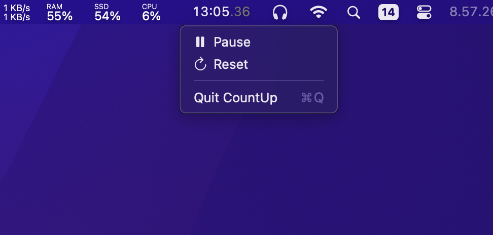

# CountUp

> **Minimal** MenuBar Stopwatch

<a href="https://github.com/othneildrew/Best-README-Template"><strong>Install v2.3 »</strong></a>  

I created this because I wanted a stopwatch app that lives in the menu bar. Many existing apps were closed-source, paid, non-minimal, or no longer maintained.

> [!WARNING]
> This app is **not signed or notarized.** macOS may show a warning the first time you open it.
